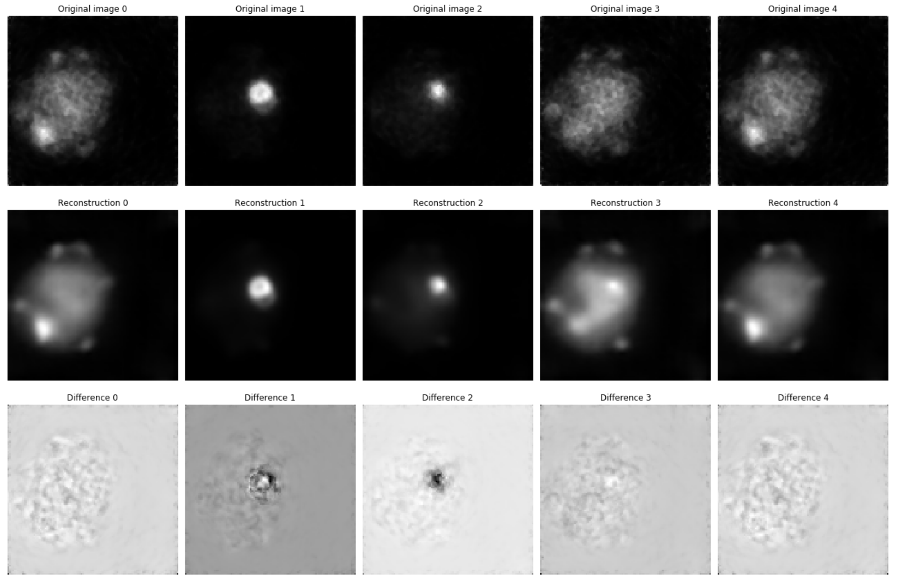

### Data Info
#### 1. Original data
From OSEM-SSRB (**O**rdered **S**ubset **E**xpectation **M**aximization
**S**ingle-**S**lice **R**e**b**inning)  
Sinogram infomation
- Dimension: 1002 x 400 x 500  
    - 6 frames x 167 slices = 1002
    - number of projections = 400
    - volume size = 500
- Pixel spacing: [0.3, 0.3]
- Slice thickness: 0.585

Reconstruction information
- Dimension: 978 x 105 x 105
    - 6 frames x 163 slices = 978
- Pixel spacing: [0.4, 0.4]
- Slice thickness: 0.585

#### 2. Augmented data
##### 2.1 augmentation 1
- Modified original data:
    - Image & Sinograms: z from 80 - 120 (40 slices)
    - FBP from the given sinogram has different orientation:
        - Do FBP on each sinogram slice -> fbp_recon
        - Cropping the fbp_recon (500x500 -> 140x140) -> cropped_fbp_recon
        - Flip the transpose of cropped_fbp_recon (same orientation now) -> modified_recon
        - Compute the radon give 90 projections of modified_recon -> modified_sinogram
- Augmentation methods:
    - shearing: shear_range = range(2, 6)
    - translate & rotate: translate_range = range(-9, 10, 3), rot_angle in range(0, 360, 45)
- Image info:
    - image file name: "aug_training_mouse_images1.npy"  
    - sinogram file name: "aug_training_mouse_sinograms1.npy"
    - total number: 71520 (Training), 180 (Testing)
    - image size: 105x105
    - sinogram size: 140x90
- Model detail:
    - Model file: "model1"
    - Loss function: MSE
    - Optimizer: Adam
    - Epoch: 100
    - Batch size: 50
    - Training time: 104244 seconds (around 29 hours)
    - Evaluation loss: 311.0145
    - Architecture: Convolutional Encoder-Decoder.
        - Encoder (Batch normalization momentum=0.8, LeakyReLU=0.3, input=sinogram(140x90), output=(5x3x128)):
            1. two conv2d(filters=4, kernel_size=(5, 5), strides=(1, 1), padding='same')
            2. one conv2D(filters=8, kernel_size=(5, 5), strides=(2, 2), padding='same'), next one strides=(1, 1)
            3. one conv2D(filters=16, kernel_size=(5, 5), strides=(2, 2), padding='same'), next one strides=(1, 1)
            4. one conv2D(filters=32, kernel_size=(3, 3), strides=(2, 2), padding='same'), next one strides=(1, 1)
            5. one conv2D(filters=64, kernel_size=(3, 3), strides=(2, 2), padding='same'), next one strides=(1, 1)
            6. one conv2D(filters=128, kernel_size=(3, 3), strides=(2, 2), padding='same'), next one strides=(1, 1)
        - Decoder (Batch normalization momentum=0.8, LeakyReLU=0.3, input=(5x3x128), output=image(105x105)):
            1. Conv2DTranspose(filters=256, kernel_size=(1, 3), strides=(1, 1), padding='valid'),  
               followed by two conv2d(filters=128, kernel_size=(3, 3), strides=(1, 1), padding='same')
            2. Conv2DTranspose(filters=64, kernel_size=(3, 3), strides=(1, 1), padding='valid'),  
               followed by one conv2d(filters=32, kernel_size=(3, 3), strides=(1, 1), padding='same')
            3. Conv2DTranspose(filters=32, kernel_size=(3, 3), strides=(1, 1), padding='valid'),  
               followed by one conv2d(filters=16, kernel_size=(3, 3), strides=(1, 1), padding='same')
            4. Conv2DTranspose(filters=16, kernel_size=(3, 3), strides=(1, 1), padding='valid'),  
               followed by one conv2d(filters=8, kernel_size=(3, 3), strides=(1, 1), padding='same')
            5. Conv2DTranspose(filters=8, kernel_size=(3, 3), strides=(1, 1), padding='valid'),  
               followed by one conv2d(filters=4, kernel_size=(3, 3), strides=(1, 1), padding='same')
            6. Conv2DTranspose(filters=8, kernel_size=(3, 3), strides=(1, 1), padding='valid'),  
               followed by one conv2d(filters=4, kernel_size=(3, 3), strides=(1, 1), padding='same')
            7. Conv2D(filters=1, kernel_size=(3, 3), strides=(1, 1), padding='valid'),  
               followed by one conv2d(filters=1, kernel_size=(8, 8), strides=(1, 1), padding='valid')
    - Results
        
